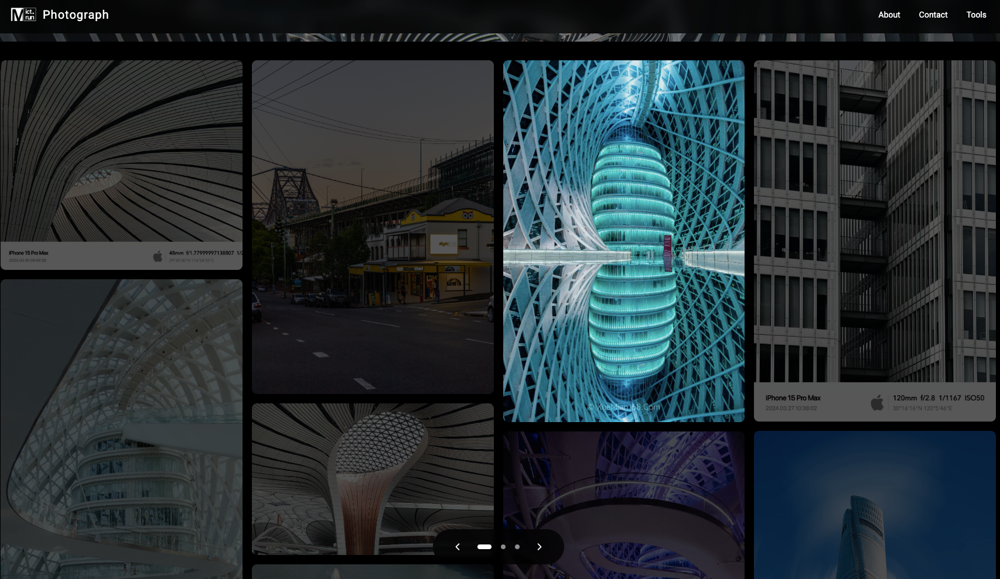

# Waterfall Photography

[](https://react.dev/)
[](https://www.typescriptlang.org/)

个人/工作室摄影作品展示平台，融合艺术性与技术性，提供沉浸式的视觉体验和实用的摄影工具。

## 🌟 功能亮点

### 画廊体验
- **主题化展示**：城市建筑/公共交通/自然风光三大主题
- **智能布局**：响应式瀑布流自动适应屏幕尺寸
- **交互细节**：悬停放大效果 + 键盘导航（←→ Esc）
- **渐进加载**：模糊到清晰的懒加载优雅效果

### 专业工具
- 🎞️ **EXIF 水印生成器**
  - 自动解析 50+ 相机型号参数
  - 支持 Canon/Sony/Fuji 等品牌 Logo

## Demo
🔗 [p.ict.run](http://p.ict.run)
 



### 技术特性
```bash
├── 核心框架：React 18 + TypeScript
├── 样式引擎：Tailwind CSS
├── 构建工具：Vite 5
└── 图标库：Lucide React


## 安装依赖
npm install

## 启动开发服务器
npm run dev
